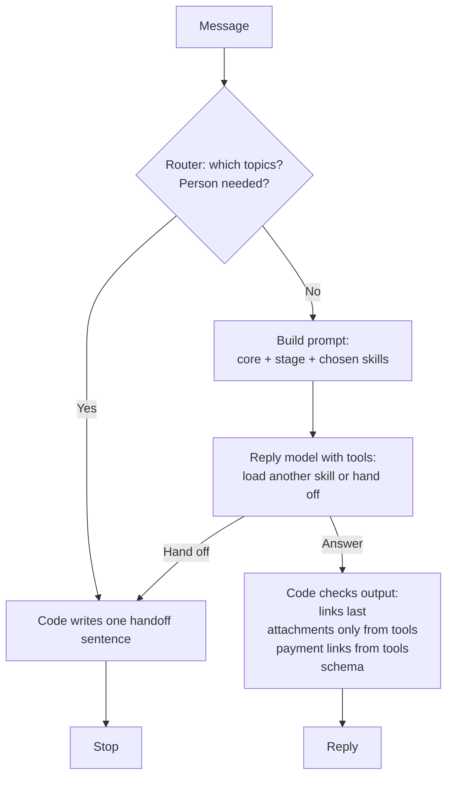
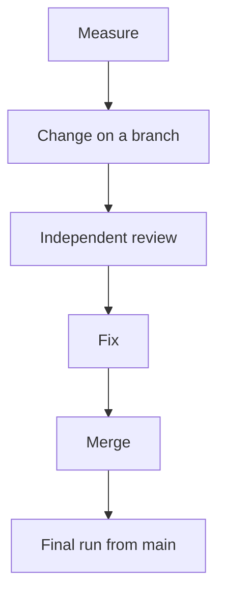

# Doctours SMS reply agent

This is a TypeScript SMS reply agent for Doctours hair-transplant patients.
I split the original prompt into a core, patient stages, and topic files, with a router: a small model that reads each message, chooses topics, and decides when a person must take over.

## Results

This system handed off every message that needed a person in the final runs.

| Test | Original prompt (1 run) | This system (3 runs) |
|---|---|---|
| **Unseen test set (30 cases written before tuning)** | | |
| Messages that needed a person, handed off | 5 of 9 | 9 of 9 in every run |
| Handed off by mistake | 0 of 21 | 3 of 63 trials |
| Fully correct | 80% | 87% |
| Facts and checks passed | 97.1% | 96.4% |
| **Dev set (87 cases I tuned against)** | | |
| Messages that needed a person, handed off | 14 of 23 | 23 of 23 in every run |
| Handed off by mistake | 0 of 64 | 12 of 192 trials |
| Fully correct | 78% | 92% |
| **The packet's 5 sample messages, scored separately** | | |
| Fully correct | 1 of 5 | 5 of 5 in every run |
| **Cost per message on dev** | $0.0149 | $0.0079 |

The packet says the current system has no human handoff; the original prompt assumes upstream routing and directs creator inquiries to Molly by email, but gives no rule for setting `escalate: true`, so its handoff numbers show what the model does without that rule.

I wrote the 87 dev cases and their expected answers; the 30-case holdout was written by a separate agent before tuning; a model grader (`gpt-6.1-sol`, the same model and low effort as the replies) checks the prose facts, with literal facts checked in code.

The gain on unseen cases is correct handoffs; facts and checks held about level.

The trade is a few false handoffs on messages the system could answer.

Latency is not a fair comparison: the original prompt's runs hit rate limits.

<details><summary>Full results, latency, cost method, and result files</summary>

The overview rounds the fully correct percentages; the exact values are below. These runs came from merged main at `1c53e5066d3adab8b63acda7223d3dfaa565260f`. Both modes use `gpt-6.1-sol` at `low` for replies; this system also uses `gpt-6-luna` at `none` for routing. The blind holdout was written by a separate agent before tuning; its SHA-256 was recorded in my experiment log, outside this repo, on 2026-10-04 before any experiment ran. The file was first committed, unchanged, with the holdout harness in PR #9, before the final runs; `git log -- evals/holdout.json` shows one commit. It ran once at the end as a final test session: original prompt (1 run), this system (3 runs).

| Measure | Dev: original prompt (1 run) | Dev: this system (3 runs) | Unseen: original prompt (1 run) | Unseen: this system (3 runs) |
|---|---|---|---|---|
| Handoff decision correct, all messages | 89.7% (78/87) | 95.4% (249/261) | 86.7% (26/30) | 96.7% (87/90) |
| Messages that needed a person, handed off | 60.9% (14/23) | 100.0% (69/69) | 55.6% (5/9) | 100.0% (27/27) |
| Messages that didn't, answered instead | 100.0% (64/64) | 93.8% (180/192) | 100.0% (21/21) | 95.2% (60/63) |
| Facts and checks passed | 94.6% (383/405) | 97.9% (1189/1215) | 97.1% (135/139) | 96.4% (402/417) |
| Fully correct | 78.2% (68/87) | 92.3% (241/261) | 80.0% (24/30) | 86.7% (78/90) |
| Passed in all 3 runs | Not measured | 90.8% (79/87) | Not measured | 86.7% (26/30) |
| Latency per message, median / 95th percentile (ms) | 18370 / 50530 | 8762 / 18331 | 17396 / 47332 | 9808 / 21910 |
| Batch cost per message (USD) | $0.0149 | $0.0079 | $0.0139 | $0.0061 |

On unseen cases, required handoffs rose from 5/9 to 27/27, and overall handoff decisions from 86.7% to 96.7%. The original prompt often answers or declines in place, avoiding false handoffs while missing required ones. This system catches every required handoff in these runs but answers fewer of the messages that did not need one. Every remaining false-handoff case is listed under [Known limits and next steps](#known-limits-and-next-steps).

The original prompt's dev run saw 237 rate-limit (429) responses; its unseen run saw 73; this system's runs saw 0. Latency includes retry waits and excludes grading, across the whole batch including packet samples. I do not claim a latency speedup from this comparison.

Cost per message is `(usage.reply.cost + usage.router.cost)` divided by message trials in the batch, including packet samples and repeats, rounded to four decimal places. I use the unrounded stored costs and exclude the test-only grader. The estimates use the test runner's recorded token prices, including cached input and cache writes.

The 5 packet samples had the same scores in the dev and unseen batches:

| Packet-sample measure | Original prompt (1 run) | This system (3 runs) |
|---|---|---|
| Handoff decision correct, all messages | 80.0% (4/5) | 100.0% (15/15) |
| Messages that needed a person, handed off | 50.0% (1/2) | 100.0% (6/6) |
| Messages that didn't, answered instead | 100.0% (3/3) | 100.0% (9/9) |
| Facts and checks passed | 65.0% (13/20) | 100.0% (60/60) |
| Fully correct | 20.0% (1/5) | 100.0% (15/15) |
| Passed in all 3 runs | Not measured | 100.0% (5/5) |

Result files: [original prompt, dev](evals/results/baseline-2026-10-05-0529.json), [original prompt, unseen](evals/results/baseline-2026-10-05-0548.json), [this system, dev](evals/results/restructured-2026-10-05-0554.json), [this system, unseen](evals/results/restructured-2026-10-05-0619.json).

</details>

## Run it

The command reads messages from a JSON file and writes one reply per message, in the same order.

You need Git, Node.js 24.2.0 or later ([package.json](package.json)), and an OpenAI API key for the configured models. Node runs the `.ts` files directly with built-in type stripping.

```sh
npm ci
export OPENAI_API_KEY="your-key"
```

Save this as `input.json`, using the packet's `HUMAN_MESSAGES` shape:

```json
[
  { "id": "demo", "text": "Which city is Heva Clinic in?" }
]
```

```sh
node src/cli.ts input.json > output.json
```

`output.json` is a JSON array of [Reply](src/reply.ts) objects. Each message is an independent turn on the packet's fixed history in [src/data.ts](src/data.ts).

<details><summary>Key file, model overrides, traces, and test commands</summary>

For stdin, omit the input argument or use `-`. Instead of exporting the key, put `OPENAI_API_KEY=your-key` in a local env file outside the repository:

```sh
node --env-file=/path/to/local.env src/cli.ts input.json > output.json
```

[src/cli.ts](src/cli.ts) accepts these defaults and overrides:

| Environment variable | Default | Controls |
|---|---|---|
| `ROUTER_MODEL` | `gpt-6-luna` | Router model, this system only |
| `ROUTER_EFFORT` | `none` | Router reasoning effort |
| `REPLY_MODEL` | `gpt-6.1-sol` | Reply model, both modes |
| `REPLY_EFFORT` | `low` | Reply reasoning effort |
| `CONCURRENCY` | `2` | Positive integer limiting messages in flight |

The default is `--mode restructured`; add `--mode baseline` to use the original prompt. Add `--trace` with a file path to record each completed message:

```sh
node src/cli.ts --trace trace.jsonl input.json > output.json
```

Each JSON line records the input index, router decision, loaded skills, tools, tokens, cached tokens, and latency. The trace file is overwritten at the start; a trace write failure is reported to stderr once and replies still finish in order, with handoffs preserved. Stdout contains only the reply array.

```sh
npm run typecheck && npm test
node evals/run.ts --mode baseline --repeat 1
node evals/run.ts --mode restructured --repeat 3
node evals/run.ts --mode restructured --cases-file ./holdout.json --repeat 3
```

Live tests need the key; `--cases-file` paths resolve relative to `evals/run.ts`. `--cases` selects comma-separated case IDs; `--concurrency` controls test concurrency. The grader defaults to `gpt-6.1-sol` at `low`, overridden by `GRADER_MODEL` and `GRADER_EFFORT`. The runner writes files under [evals/results](evals/results) and prints a Markdown report. See [evals/README.md](evals/README.md) for scoring and router-only tests.

</details>

## How it works

I use the Responses API and a small TypeScript tool loop to keep each SMS turn easy to inspect.



The deliverable is a batch command with a narrow contract, so I chose no agent framework.

| Step | Implementation | Why |
|---|---|---|
| Read intent, choose skills, decide on a handoff | [Router](src/router.ts), [instructions](prompts/router.md) | A cheap model picks topic rules and can skip the reply call. |
| Build core + stage + selected skills | [Prompt assembly](src/prompts.ts), [turn](src/restructured.ts) | Code chooses the stage from `PIPELINE_STATUS`, fills constants, and rejects unfilled placeholders. |
| Reply with tools | [Reply loop](src/respond.ts), [tools](src/tools.ts) | Tools supply facts; `loadSkill` adds missing rules, and code enforces which tools may run. |
| Check and clean the output | [Reply checks](src/reply.ts) | Code sets `templateId` to null, puts URLs last, keeps only attachments returned by tools this turn, and hands off untrusted payment or checkout links. |
| Write a handoff and stop | [Handoff code](src/escalation.ts) | Code sends one sentence without a continued answer or echoed payment details. |

The router's intent becomes `Reply.intent` when routing succeeds. A reply-model handoff stops the loop before any tools returned alongside it run. [src/cli.ts](src/cli.ts) preserves batch order and lets other messages finish if a turn fails.

## What loads on every message

Every reply turn loads the core and one patient stage, plus only the topic skills it needs.

| Prompt | What loads | Characters | Approximate tokens |
|---|---|---|---|
| Original prompt | Whole prompt on every message | 164,678 | ~41,169 |
| This system: core | Identity, voice, grounding, handoff rules, and patient context | 39,965 | ~9,991 |
| This system: a large combination | Core + the largest stage (`PRE_CLINICAL_SENT`) + the two largest skills (`financing`, `packages-and-pricing`) | 80,185 | ~20,046 |

Sizes come from [docs/prompt-map.md](docs/prompt-map.md), before filling placeholders and without front matter. They are file-size estimates, not API usage. In the final runs the median reply turn loaded 65,799 characters (~16,449 tokens); 23 of 262 reply turns, each with three or more skills, loaded more than the row above, up to 109,871 characters (~27,467 tokens). The core is still large. Filling placeholders adds the same patient values to both modes.

The [stage file](prompts/stages) follows `PIPELINE_STATUS` and governs what the coordinator may do at that point. The router chooses [skills](prompts/skills) from their descriptions; code adds `intake` when collection is outstanding or this is first contact. Code offers the promo tool only when `PROMO_OFFER` is set. The reply model can load an omitted skill with its tools, and that load is traced; an early handoff needs no reply prompt or call.

I put fixed tool definitions and core + stage before message-specific skills, with an explicit cache breakpoint and a cache key per stage. `allowed_tools` limits what can run without changing the definitions sent to the API, so matching prefixes can be read from cache across the batch and later tool rounds. Caching reduces billed input work while keeping the instructions in context; [cache tests](test/cache.test.ts) check the prefix.

## When it hands off to a person

I hand off requests for a person or work no tool and no rule can perform, following packet L7.

| Hands off | Answers | Packet lines |
|---|---|---|
| Contact the clinic for the patient | A question about contacting the clinic | L913 |
| Take on creator or partnership business | A question about the creator policy | L955 |
| Reach the clinic, or a repeated request for its contact details | An initial question about clinic contact policy | L980 |
| Match a clinic's direct quote | A question about the price-match policy | L1039 |
| Honor a claimed discount, hold a date without payment, or change a booking | A question about discount, date-hold, or booking policy | L1317 |
| Arrange a call other than the self-booked free consultation | A question about calls or self-booking a free consultation | L1407 |
| Verify specific open procedure dates | A question about scheduling policy | L1436 |

A request to do the action hands off; a policy question gets an answer, even when the answer is no. Asking for the named coordinator does not hand off because the model replies as that coordinator. Payment links, consultation booking/rescheduling, and package facts stay automated. These decisions include judgment calls; [evals/README.md](evals/README.md) records the alternatives.

The router decides first, using `human_requested` or `cannot_do`. The reply model catches misses, follows prescribed policy refusals, and hands off medical safety updates; a passing medical mention is not a record-update request. Code writes the sentence and clears attachments, follow-up, and working-memory updates. Every URL-like token, with or without a scheme, is percent-decoded and lowercased for the check. If it contains `payment` or `checkout`, its original spelling must exactly match a URL a tool returned this turn; otherwise code writes a `system_error` handoff. Static consultation, clinic, and assessment pages stay allowed.

<details><summary>Failures, handoff reasons, and trace categories</summary>

A 401, 403, 404, billing error (`insufficient_quota`), or configuration 400 stops the batch and eval runs. The CLI and both eval commands print the same one-line status, message, and configuration hint (including `GRADER_MODEL`) to stderr and exit nonzero without writing results. The batch CLI writes nothing to stdout. Message-level 400 codes such as `context_length_exceeded` and `invalid_prompt` hand off only that message as `system_error`; [src/api-errors.ts](src/api-errors.ts) lists all recognized codes. The router-only eval records these as failures of the individual case and continues.

Other rate limits (429), server errors (5xx), timeouts, and connection errors keep the fallback paths: a failed reply turn hands off as `system_error` after retries.

A temporary router failure falls back to a reply with core + stage + any skill code always adds (`intake` when needed) and `loadSkill` available; it does not automatically page a person.

`Reply.escalate` flags takeover; `Reply.escalationReason` carries the code-set reason. `Reply` has no category field.

The trace's `escalationCategory` is `human_requested`, `cannot_do`, `reply`, or `system_error`. `reply` means the reply model handed off after the router did not, so the router assigned no handoff category.

When routing succeeds, the trace records the router's intent; when routing fails, it records the router's error instead. When the router hands off, the trace also keeps its one-line reason.

[Handoff tests](test/escalation.test.ts) and [turn tests](test/restructured.test.ts) cover these paths.

</details>

## The packet's eight problems, and what I did

I separated topic rules and testable steps, with some problems only partly addressed.

<details><summary>What I did for each problem, with evidence and limits</summary>

| Problem | What I did | Evidence and limit |
|---|---|---|
| 1. Unneeded rules crowd context | I load topic skills per message: [skills](prompts/skills). | [Prompt sizes](docs/prompt-map.md) show fewer instructions; I did not measure attention. |
| 2. A trace cannot locate a bad reply | I trace routing, skills, dynamic loads, and tools: [turn](src/restructured.ts). | [Trace tests](test/restructured.test.ts) show what was available, not which instruction caused a decision. |
| 3. Another care line competes with hair rules | I separated stages and topics: [assembler](src/prompts.ts). | **Partly:** [core](prompts/core.md) and the router remain hair-specific; no second care line is built or measured. |
| 4. A subtask has nowhere to go | I expose full call records through a tool: [consultation skill](prompts/skills/consultation.md). | **Partly:** I chose no subagent for a local SMS turn; [tools](src/tools.ts) expose the records, and bulk inspection is where I would add one. |
| 5. Every message pays for the full prompt | I select skills, cache the prefix, and skip replies on early handoffs: [turn](src/restructured.ts). | [Cache tests](test/cache.test.ts) and final costs support this; rate limits leave latency causality unresolved. |
| 6. A small policy edit affects unrelated replies | I put topic rules in separate files: [skills](prompts/skills). | **Partly:** [assembly tests](test/restructured.test.ts) check loading, but core edits affect all replies and arbitrary edits' reach is unmeasured. |
| 7. Conflicts have no recorded winner | I record precedence and enforce output rules in code: [prompt map](docs/prompt-map.md). | [Map tests](test/prompt-map.test.ts) check the map; the decisions are below. |
| 8. Behaviors cannot be tested separately | I separate routing, schema, handoff, and factual checks: [scorer](evals/score.ts). | [Router-only eval](evals/router.ts), [reply tests](test/reply.test.ts), and final per-topic summaries show separate checks. |

</details>

## How I tested and built it

I measured changes during development, then ran the final comparison from merged main.

- I compare the [original prompt](baseline/system-prompt.md), filled with packet constants, against this system in the same test runner, using the same mock tool code, reply schema, and output checks. The original gets no new router or handoff prompt.
- The 87 handwritten dev cases cover topics, request/question pairs, and messy input on the fixed patient history. The 5 packet samples are scored separately. Their expected replies never enter application prompts or code; a [guard test](test/samples-guard.test.ts) checks for sample references.
- The [scorer](evals/score.ts) checks handoffs and literal facts in code, then uses a `gpt-6.1-sol` grader at `low` for meaning. Model grading can miss omissions or disagree with short answers. It is evidence against these checks, not a safety proof.
- The blind holdout has 30 cases and hash `a96df30a97f2721824be86153dc975a295e71df4c6f10f0058c1a14f99960c58`, checked before the final run. Its writer saw no dev messages or failures, but saw the test README's topic list and ambiguous case IDs. Wording and facts are independent; topic coverage overlaps.
- Every change was a PR with an independent Codex review and a Greptile review; each of the four shipped changes below also had measured before/after results. Review rejected some apparent gains and required fixes before merge.
- I dropped an earlier router version's example messages because they mirrored dev cases with the names swapped. The shipped router has no examples, only the request-versus-question rule, and it passed an acceptance rule I wrote before testing it; the details are below.



<details><summary>What counts as fully correct</summary>

- Code checks handoff decisions exactly.
- Code checks facts that are only a URL, email, dollar amount, or digit string.
- Code also checks URLs, emails, and dollar amounts inside prose facts.
- Forbidden literals are searched in every decoded `Reply` string, not only `response`.
- The grader sees only the message, reply, and claims; it judges forbidden prose and the remaining claims by meaning.
- A case is fully correct only when its handoff decision, any scored category, and every fact and check pass; an answer must also be nonempty.
- “Passed in all 3 runs” counts cases that passed every repeat, rather than averaging trial scores.
- Errored trials are excluded from rates and reported separately; the final runs have 0.
- The holdout checks output shape but lacks some handoff-wording checks present in dev; offline tests cover those rules.

</details>

<details><summary>Shipped changes and their development measurements</summary>

These are pre-merge development comparisons, separate from the final results above. They use `gpt-6-luna` at `none` for routing and `gpt-6.1-sol` at `low` when measuring replies.

| Shipped change | What changed | Development comparison | Other development results |
|---|---|---|---|
| Router precision | A request to act differs from a policy question. | In 3 router-only runs, mistaken handoffs were 3, 4, 4 versus the old router's 6, 5, 5. | Missed handoffs were 1, 1, 1, all caught end to end in 9/9 trials. |
| Escalation scope | A prescribed refusal wins over a general capability limit. | In 3 runs with the final rule, insurance-paperwork and assessment-note were answered 3/3; previously, the reply model handed both off on dev. | `allergy-note` was still handed off 3/3; 4 medical-mention probes were answered 12/12. |
| Prompt caching | Fixed definitions, core + stage prefix, and a loaded-skill list. | Full-dev reply cost fell from $1.27 to $0.61 in 1 run. | Facts and checks were 95.1% against 95.7%; 93% of reply input was read from cache. |
| Complete answers | Prices include deposits, pages include links, and consultation answers keep their facts. | The initial 3-run check rose from 9/30 to 30/30. | Then, after review fixes, the expanded set passed 33/33 and fact samples 9/9. |

I wrote the consultation and all-packages rules after seeing sample failures, so those samples are not independent evidence. Review tightened the checks and stopped the system from sending a booking link to patients who had already booked a consultation or declined one. The holdout checks unseen cases and shows no overall gain in facts and checks.

Review found that the first new router's example messages mirrored dev cases, and the next attempt's case descriptions still mirrored those failures. I removed every example and do not claim that version's apparent gain. To ship, the final router had to make fewer mistaken handoffs than the old one, with every router miss still caught end to end.

</details>

## Contradictions in the packet

I verified the cited rules and tool data and recorded which rule I followed in the [prompt map](docs/prompt-map.md), though some conflicts remain in the moved text.

<details><summary>All ten conflicts and the decisions</summary>

| Conflict | What I followed |
|---|---|
| 1. L7 takeover vs L775/L902/L921 declines for refunds, cards, and date holds | → L7 for action requests; policy questions get the prescribed answer. |
| 2. L913/L955/L980/L1039/L1317/L1407/L1436 human routing vs L914 and each rule's "if one slips through" reply | → Router hands off requests; questions keep prescribed replies, as a recorded interpretation. |
| 3. L877 bans another Doctours person taking over; L769 bans channel excuses and unsupported promises | → L7 wins; code writes a first-person handoff with no role or timing promise. |
| 4. L331/L347 return Doctours pages; L867/L868/L1416 call `url` an independent clinic website | → I use the returned URL; the mock cannot supply an independent site, and I invent no domain. |
| 5. L981 names Heva VIP and MetropolMED, absent from L375-418; L399 gives Gold's doctor involvement | → Package `aiContext` wins when present, per L971; I invent no missing packages. |
| 6. L1041 asserts transfers; L1395 invents a price range; L989/L1519 add tiers; L1459 names an absent package; L1404 offers Miami | → Fresh tool facts and L963/L967 grounding win; examples remain text, not catalog data. |
| 7. L963-977/L1412/L1429 describe airports, hotels, add-ons, list prices, and itineraries absent from L375-418/L448-456 | → Returned data wins; missing details stay unknown, and mentions of undefined tools are removed, as the prompt map records. |
| 8. L103/L472-481 record a past call, while L105 starts a first-contact intro | → I preserve history and follow L1045's no-repeat-intro rule and L898's current calling limit; a past call gives no calling tool. |
| 9. L896 allows later photos, while L896/L912 ban future-content promises | → L82's current-turn attachment limit wins in code; inconsistent wording remains, with no future send implemented. |
| 10. L883/L1549 suppress repeated links and L994 asks for the answer alone; L759 requires deposits and assessment/consultation links | → I follow L759 narrowly with deposit and page-link rules; consultation links still respect booking state, refusal, and no-repeat rules. |

</details>

## Known limits and next steps

I would first reduce early false handoffs, which skip the reply model's chance to correct the router.

- The router can still hand off requests with prescribed policy refusals, including insurance paperwork and financing enrollment (L836/L858). I would test letting the reply model decide those cases against new request/question pairs.
- In the final runs, all false handoffs came from the router. Clinic contact, card talk, and surgeon contact are the main repeats; identity and creator policy also misfired on dev.
- Some answers still omit facts. I would add independent checks before changing rules, without writing around a holdout sentence.
- The holdout is small and uses a fixed patient state. I would test new histories and stage transitions, keep a new blind set, and lock the recorded hash in automated checks.
- The tools are mocks and no staff queue is connected. I would connect real services, verify workflow contracts, and redact sensitive traces before product use.

<details><summary>Remaining false handoffs, answer failures, and integration limits</summary>

These are case IDs and counts, not patient texts:

| Set | Case ID | Trials handed off incorrectly |
|---|---|---|
| Dev (3 runs) | `heva-whatsapp` | 3/3 |
| Dev (3 runs) | `gold-ready-card-offer` | 3/3 |
| Dev (3 runs) | `surgeon-before-deposit` | 3/3 |
| Dev (3 runs) | `are-you-real` | 2/3 |
| Dev (3 runs) | `creator-question` | 1/3 |
| Unseen (3 runs) | `h-website-contact-heva` | 3/3 |

Other final failures include omitted financing mechanics on dev. Holdout failures include a clinic-specialty omission, unnecessary clarification about surgeon involvement, and an omitted cash-pay fact. Repeats measure consistency on the same cases; today's automated checks verify holdout shape but do not lock its hash.

Mock writes do not persist across turns, and `escalate: true` is an output signal without a connected staff queue. The documented assessment-revision and follow-up workflows are assumed, not implemented. A second care line and bulk call-log delegation would need their own prompts and measurements.

</details>
